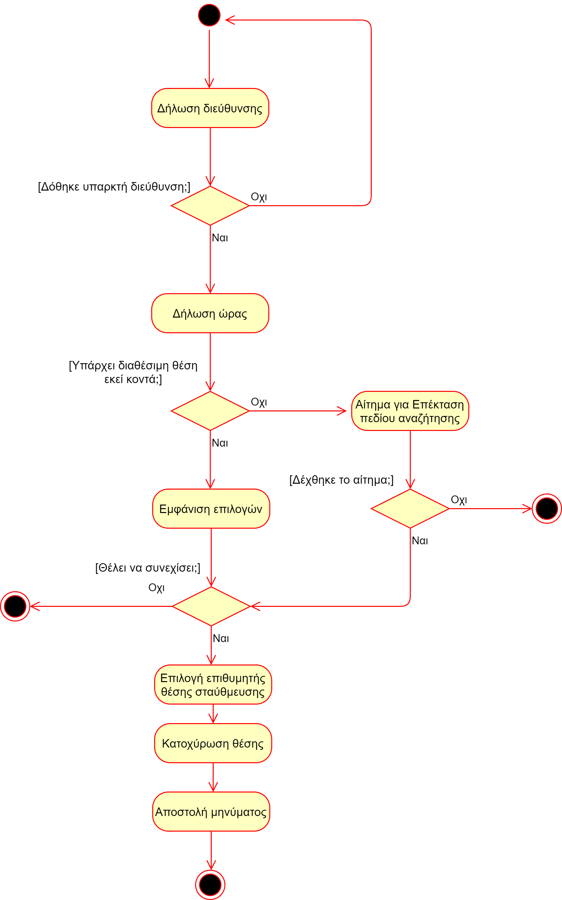
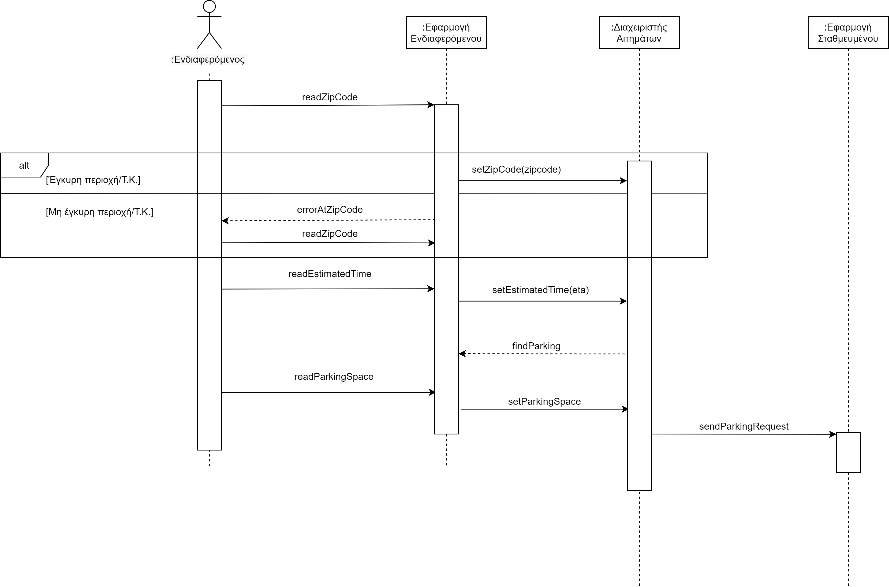
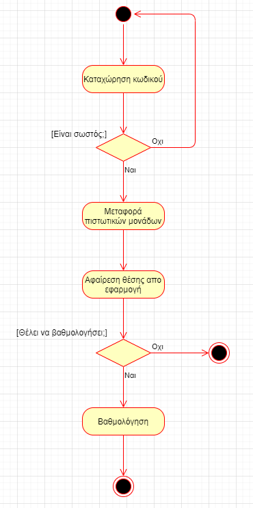
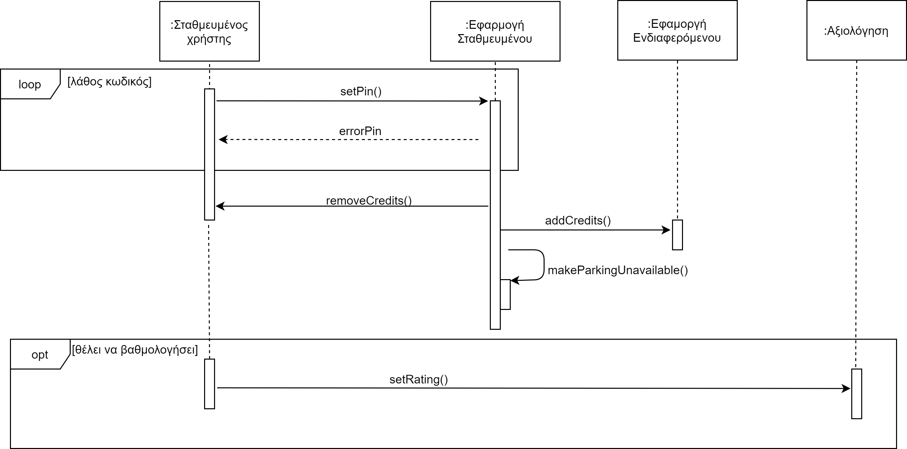
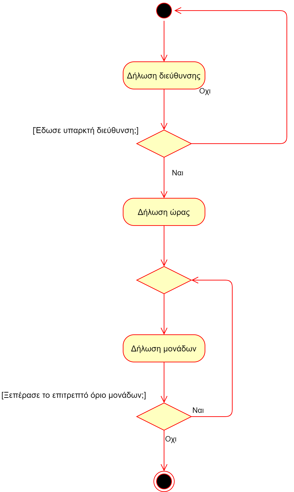
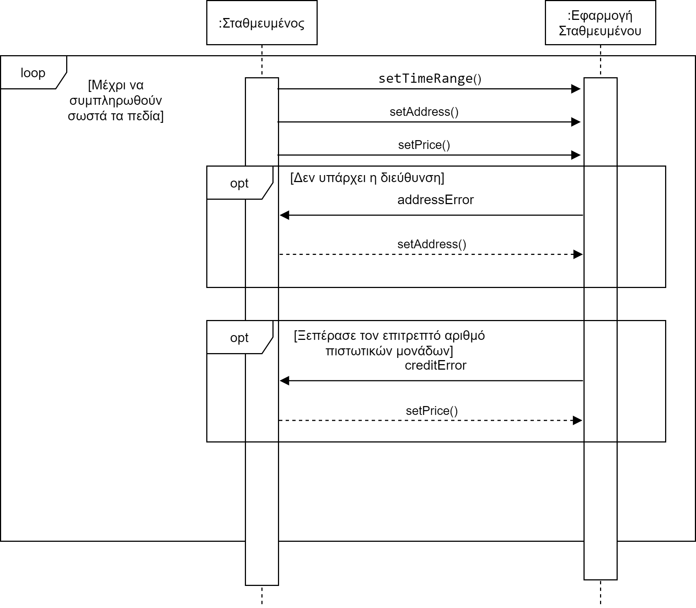
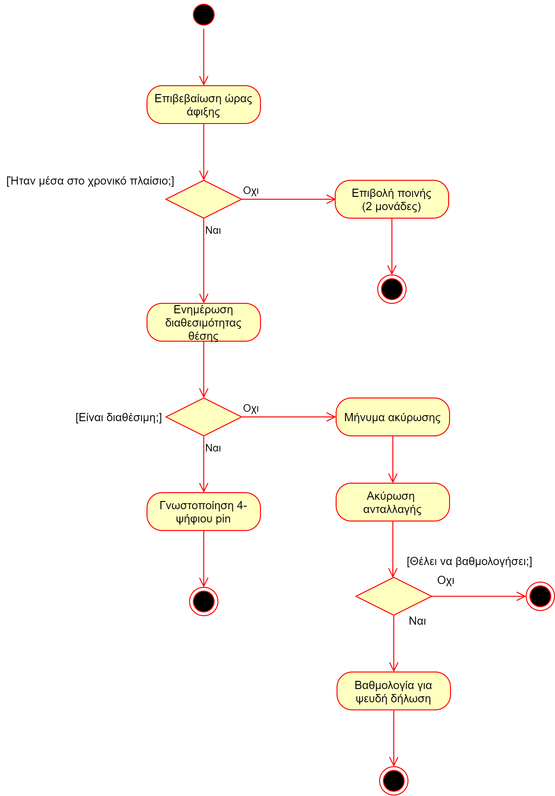

# Class Diagram

# Use Case Diagram

# Αίτημα για θέση στάθμευσης

**Πρωτεύων Actor**: Ενδιαφερόμενος χρήστης  
**Ενδιαφερόμενοι (Stakeholders)**: Σταθμευμένος χρήστης  
**Προϋποθέσεις**: Πρέπει να έχει ολοκληρωθεί επιτυχώς η Π.Χ. "Διαθεσιμότητα της θέσης στάθμευσης" και να έχει επαρκείς πιστωτικές μονάδες.  
**Βασική ροή γεγονότων**:   
1) Δηλώνει την περιοχή και τον εκτιμώμενο χρόνο που θα φτάσει.  
2) Το σύστημα του εμφανίζει θέσεις στάθμευσης στην περιοχή που έχει υποδείξει, μετά την ώρα που έχει βάλει.  
3) Επιλέγει την θέση που προτιμάει.  
4) Η εφαρμογή στέλνει μήνυμα στον σταθμευμένο χρήστη. 

**Εναλλακτικές ροές**:   
* Σε οποιοδήποτε σημείο το λογισμικό καταρρέει.
    1. Γίνεται reload η σελίδα  
        1α) Αποτυχία επικοινωνίας με server

1) Η περιοχή που εισήγαγε δεν υπάρχει.  
    1. Του εμφανίζεται μήνυμα από το σύστημα.   
 

2) Δεν υπάρχουν θέσεις/χρήστες στην περιοχή που έχει υποδείξει.  
    1. Το σύστημα του στέλνει μήνυμα να επεκτείνει την περιοχή αναζήτησης του. 

  
**Διάγραμμα ακολουθίας:**   

# Ανταλλαγή θέσης στάθμευσης

**Πρωτεύων Actor**: Σταθμευμένος χρήστης  
**Ενδιαφερόμενοι (Stakeholders)**: Ενδιαφερόμενος χρήστης  
**Προϋποθέσεις**: Πρέπει να έχει ολοκληρωθεί επιτυχώς η Π.Χ. "Επιβεβαίωση διαθεσιμότητας θέσης"  
**Βασική ροή γεγονότων**:  
1) Καταχωρεί τον κωδικό που του έχει δώσει προφορικά ο ενδιαφερόμενος χρήστης στην εφαρμογή.  
2) Το σύστημα του μεταφέρει τις μονάδες στον λογαριασμό του από τον λογαριασμό του ενδιαφερόμενου.     
3) Το σύστημα αφαιρεί τη θέση απο την εφαρμογή.  
4) Βαθμολόγηση ενδιαφερόμενου. 

**Εναλλακτικές ροές**:  
* Σε οποιοδήποτε σημείο το λογισμικό καταρρέει.
    1. Γίνεται reload η σελίδα  
        1α) Αποτυχία επικοινωνίας με server

1 ) Λάθος κωδικός.  
    
1. Το σύστημα ζητάει να επαναπληκτρολογηθεί ο κωδικός.  

4 ) Απόρριψη αιτήματος βαθμολόγησης ενδιαφερόμενου χρήστη.

  
**Διάγραμμα ακολουθίας:**    

# Διαθεσιμότητα της θέσης στάθμευσης

**Πρωτεύων Actor**: Σταθμευμένος χρήστης  
**Ενδιαφερόμενοι (Stakeholders)**: -  
**Προϋποθέσεις**: -  
**Βασική ροή γεγονότων**:  
1) Ο σταθμευμένος χρήστης δηλώνει την διαθεσιμότητα της θέσης πάρκινγκ γνωστοποιώντας την ώρα, την διεύθυνση και τις πιστωτικές μονάδες που επιθυμεί για την ανταλλαγή.    

**Εναλλακτικές ροές**:   
* Σε οποιοδήποτε σημείο το λογισμικό καταρρέει.
    1. Γίνεται reload η σελίδα  
        1α) Αποτυχία επικοινωνίας με server

1α) Ζητάει παραπάνω πιστωτικές μονάδες από το επιτρεπτό όριο και εμφανίζεται κατάλληλο μήνυμα.  
1β) Δεν υπάρχει η διεύθυνση που έχει δώσει. 

  
**Διάγραμμα ακολουθίας:**    

# Διαχείριση αιτημάτων ανταλλαγής 

**Πρωτεύων Actor**: Σταθμευμένος χρήστης    
**Ενδιαφερόμενοι (Stakeholders)**: Ενδιαφερόμενος χρήστης   
**Προϋποθέσεις**: Πρέπει να έχει ολοκληρωθεί επιτυχώς η Π.Χ. "Αίτημα για θέση στάθμευσης".  
**Βασική ροή γεγονότων**: -
1) Λαμβάνει μήνυμα από το σύστημα και βλέπει την αξιοπιστία του αιτούντα (π.χ. αξιολόγηση, μέσος χρόνος καθυστέρησης).  
2) Αποδέχεται το αίτημα του ενδιαφερόμενου.  
3) Το σύστημα στέλνει το αίτημα έγκρισης στον ενδιαφερόμενο.  

**Εναλλακτικές ροές**:   
* Σε οποιοδήποτε σημείο το λογισμικό καταρρέει.
    1. Γίνεται reload η σελίδα  
        1α) Αποτυχία επικοινωνίας με server

2 ) Απορρίπτει το αίτημα του ενδιαφερόμενου. 
1. Το σύστημα στέλνει μήνυμα στον ενδιαφερόμενο χρήστη.  

# Διαχείριση οχημάτων

**Πρωτεύων Actor**: Πρόσωπο  
**Ενδιαφερόμενοι (Stakeholders)**: -  
**Προϋποθέσεις**: Εχει ήδη λογαριασμό και είναι logged in.   
**Βασική ροή γεγονότων**:   
1) Ο πελάτης επιλέγει από το μενού του προφίλ του "εισαγωγή νέου οχήματος". 
2) Το σύστημα ζητάει από τον πελάτη να εισάγει τα στοιχεία του οχήματος που θέλει να προσθέσει.  
3) Το σύστημα αποθηκεύει το νέο όχημα του πελάτη.  

**Εναλλακτικές ροές**:   
* Σε οποιοδήποτε σημείο το λογισμικό καταρρέει.
    1. Γίνεται reload η σελίδα  
        1α) Αποτυχία επικοινωνίας με server

1α ) Ο πελάτης επιλέγει "διαγραφή οχήματος".
1.  Το σύστημα διαγράφει το όχημα που έχει επιλεγεί.  
    1α) Αν είναι το μοναδικό όχημα που έχει στον λογαριασμό του, εμφανίζεται μήνυμα λάθους.

1β ) Ο πελάτης επιλέγει "επεξεργασία οχήματος".
1.  Το σύστημα του εμφανίζει τα πεδία προς επεξεργασία.

2 ) Ο πελάτης δεν έχει συμπληρώσει κάποια απαραίτητα στοιχεία. 
1. Το σύστημα εμφανίζει μήνυμα που τον προτρέπει να τα συμπληρώσει.  

3 ) Το όχημα που πάει να εισάγει ο πελάτης υπάρχει ήδη καταχωρημένο στον λογαριασμό του.  
1. Εμφανίζεται κατάλληλο μήνυμα από το σύστημα.  

# Είσοδος Στο Σύστημα

**Πρωτεύων Actor**: Πρόσωπο  
**Ενδιαφερόμενοι (Stakeholders)**: -  
**Προϋποθέσεις**: Ο πελάτης έχει ήδη δημιουργήσει λογαριασμό.  
**Βασική ροή γεγονότων**:  
1) Το σύστημα ζητάει από τον πελάτη να εισάγει τα credentials του.  
2) Ο πελάτης εισέρχεται στην εφαρμογή.   

**Εναλλακτικές ροές**:  
* Σε οποιοδήποτε σημείο το λογισμικό καταρρέει.  
    1. Γίνεται reload η σελίδα  
    1α) Αποτυχία επικοινωνίας με server  

1α) Ο πελάτης δεν είναι εγγεγραμμένος στο σύστημα.  
1. Μεταφέρεται στην σελίδα εγγραφής.  

1β) Ο πελάτης έχει ξεχάσει τον κωδικό του.  
1. Αποστέλλεται μήνυμα ανάκτησης στο e-mail του.  

# Εγγραφη Στο Σύστημα

**Πρωτεύων Actor**: Πρόσωπο  
**Ενδιαφερόμενοι (Stakeholders)**: -  
**Προϋποθέσεις**: -  
**Βασική ροή γεγονότων**:   
1) Το σύστημα ζητάει από τον πελάτη να εισάγει τα προσωπικά στοιχεία του στοιχεία και τα στοιχεία του οχήματος του.  
2) Το σύστημα καταχωρεί στον λογαριασμό του πελάτη 10 πιστωτικές μονάδες.
3) Ο πελάτης εισέρχεται στην εφαρμογή.  

**Εναλλακτικές ροές**:  

* Σε οποιοδήποτε σημείο το λογισμικό καταρρέει.  
    1. Γίνεται reload η σελίδα  
    1α) Αποτυχία επικοινωνίας με server  

1α) Ο πελάτης είναι ήδη εγγεγραμμένος στο σύστημα.  
1. Το σύστημα τον μεταφέρει στην σελίδα εισόδου. 
 

  
1β) Ο πελάτης δεν έχει συμπληρώσει κάποια απαραίτητα στοιχεία για την εγγραφή του.  
1. Το σύστημα εμφανίζει μήνυμα που τον προτρέπει να τα συμπληρώσει. 

# Επαναφόρτιση Πιστωτικών Μονάδων

**Πρωτεύων Actor**: Πρόσωπο  
**Ενδιαφερόμενοι (Stakeholders)**: -  
**Προϋποθέσεις**: -  
**Βασική ροή γεγονότων**:   
1) Επιλέγει να επαναφορτίσει τις πιστωτικές μονάδες.
2) Επιλέγει τον αριθμό των πιστωτικών μονάδων που θέλει να προσθέσει.
3) Εισάγει τα δεδομένα της κάρτας του και ολοκληρώνει την συναλλαγή.

**Εναλλακτικές ροές**:   

* Σε οποιοδήποτε σημείο το λογισμικό καταρρέει.  
    1. Γίνεται reload η σελίδα  
    1α) Αποτυχία επικοινωνίας με server  

3) Η κάρτα δεν γίνεται αποδεκτή.  
1. Εμφανίζεται σχετικό μήνυμα λάθους για επαλήθευση στοιχείων.  
 

# Επιβεβαίωση διαθεσιμότητας θέσης
**Πρωτεύων Actor**: Ενδιαφερόμενος χρήστης  
**Ενδιαφερόμενοι (Stakeholders)**: Σταθμευμένος χρήστης  
**Προϋποθέσεις**: Πρέπει να έχει αποδεχτεί το αίτημα στην Π.Χ. "Διαχείριση αιτημάτων ανταλλαγής" ο σταθμευμένος  
**Βασική ροή γεγονότων**:   
1) Όταν φτάσει στην θέση, πληκτρολογεί στην εφαρμογή αν είναι διαθέσιμη.  
2) Δίνει προφορικά στον σταθμευμένο χρήστη το 4-ψηφιο pin.  

**Εναλλακτικές ροές**:   

* Σε οποιοδήποτε σημείο το λογισμικό καταρρέει.  
    1. Γίνεται reload η σελίδα  
    1α) Αποτυχία επικοινωνίας με server  

1α) Έχει γίνει ψευδής δήλωση από τον σταθμευμένο χρήστη.   
 

1. Έχει την δυνατότητα να βαθμολογήσει αρνητικά τον σταθμευμένο. 

1β) Δεν έχει φτάσει μετά απο ενα όριο.
    
1. Το σύστημα ακυρώνει την ανταλλαγή και στέλνει μήνυμα στον σταθμευμένο .
2. Το σύστημα του δεσμεύει 2 πιστωτικές μονάδες.

  
**Διάγραμμα ακολουθίας:**  

# Παραπάνω μη λειτουργικές απαιτήσεις

*  Ποιότητας-ασφάλειας:Οι κωδικοί θα αποθηκέυονται με ασφαλή τρόπο, κρυπτογραφημένοι, για την ακεραιότητα των δεδομένων των χρηστών και σε περίπτωση που θα ξεχάσουν
τον κωδικό τους θα τους αποστέλλετε e-mail ανάκτησης

*  Κατασκευαστική συντήρησης: Ο κώδικας θα είναι καθαρογραμμένος ώστε να μπορεί να προστεθεί λειτουργικότητα και να μπορεί να γίνει debug ή μελλοντικές αλλαγές.

*  Ποιότητας-αξιοπιστίαςΣε περίπτωση που θα υπάρξει error την στιγμή που θα γίνει το transaction, με την χρήση exception handling, δεν θα χαθούν πιστωτικές μονάδες.

*  Ποιότητας-αξιοπιστίας: Με την χρήση του κωδικού για την ανταλλαγή θέσης υπάρχει αξιοπιστία στο σύστημα, αφου είναι πολυ δύσκολο να γίνει λάθος ταυτοποίηση.

*  Ποιότητας-επίδοσης-χρόνου: Το σύστημα θα παρέχει στην εταιρεία λειτουργίας της υπηρεσίας,  στατιστικά
στοιχεία σχετικά

*  Διεπαφής-χρήσης: Η ανταλλαγή θέσης στάθμευσης συνοδεύεται με μεταφορά πιστωτικών μονάδων προς το σταθμευμένο χρήστη από τον χρήστη που λαμβάνει τη θέση στάθμευσης.

*  Συμμόρφωσης/ποιότητας-διεπαφής-χρήσης: Ο χρήστης κάνει log-in με τον κωδικό και το username του.

*  Συμμόρφωσης: Ο χρήστης ζητάει απο το σύστημα μια θέση παρκινγκ, εισάγωντας την περιοχή και την ώρα που επιθυμεί, ταξινομώντας με βάση της απόστασης απο τον τελικό προορισμό.

