# Αίτημα για θέση στάθμευσης / Find Parking

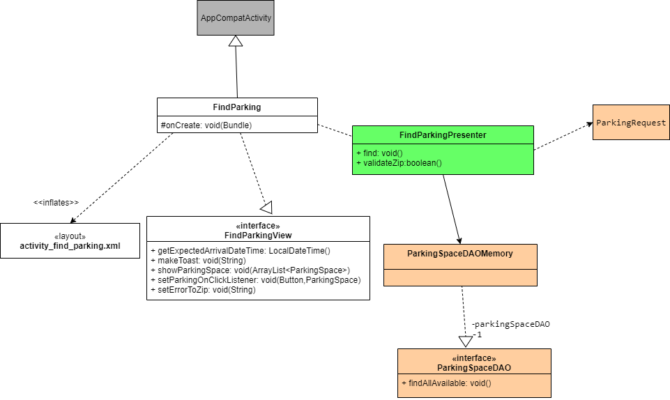   
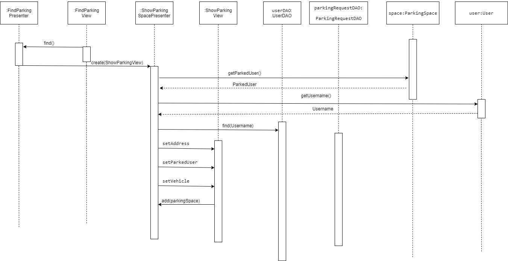

# Ανταλλαγή θέσης στάθμευσης / Enter Pin

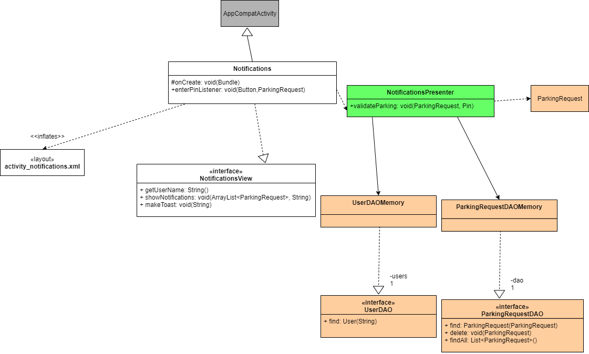   
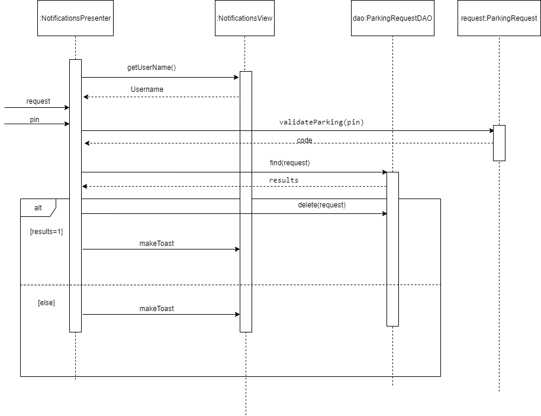

# Διαθεσιμότητα της θέσης στάθμευσης / Add Your Parking Space

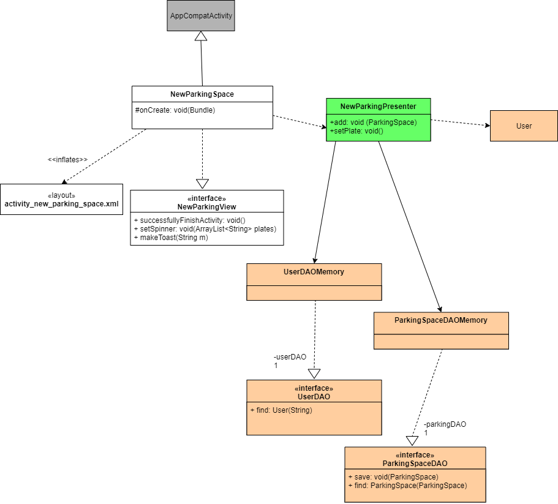   
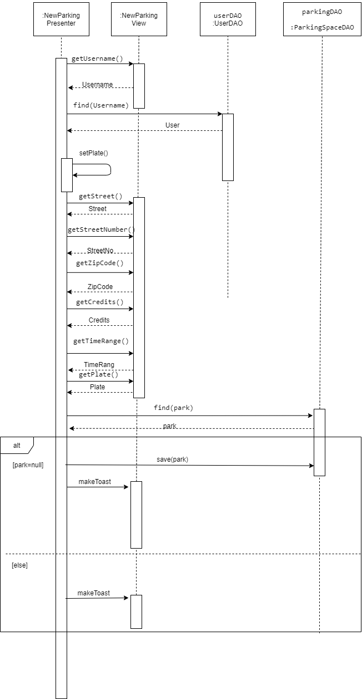

# Διαχείριση αιτημάτων ανταλλαγής / Parking Request Notification [Accept/Deny]

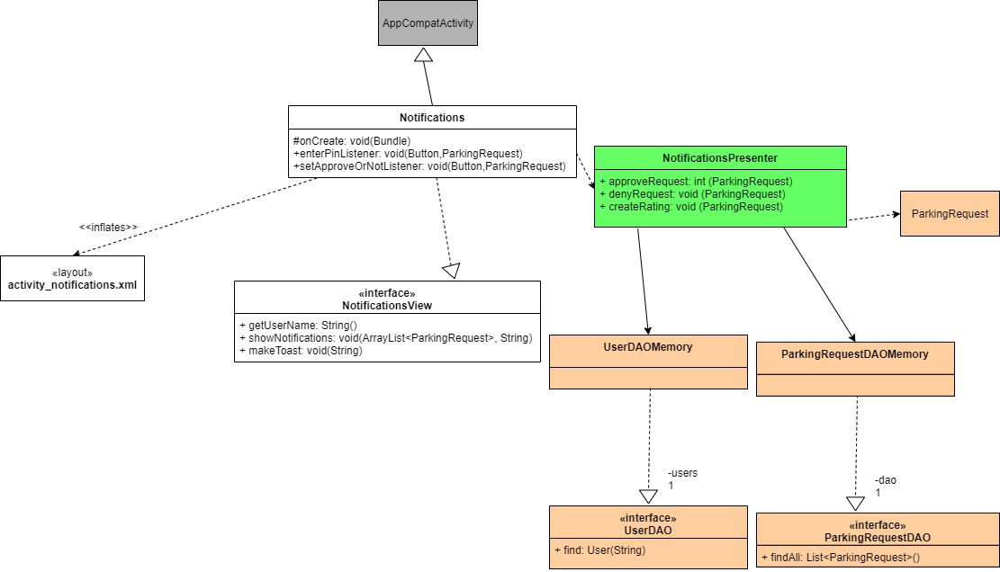   
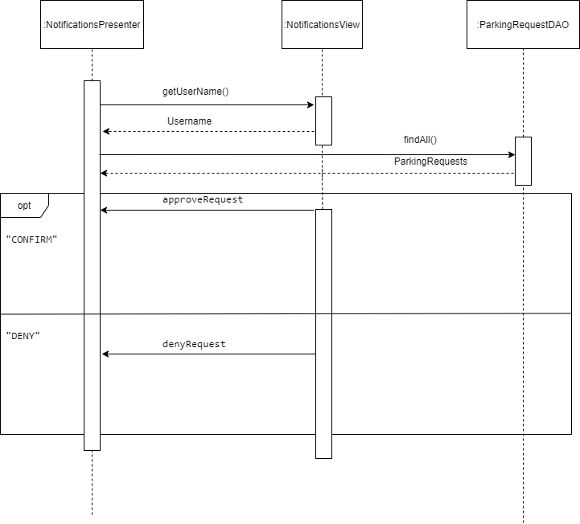

# Διαχείριση οχημάτων / Edit Vehicle

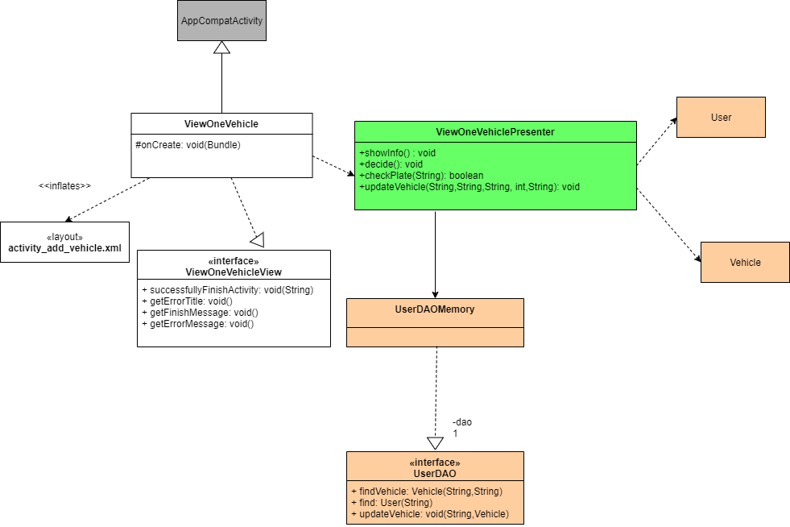   
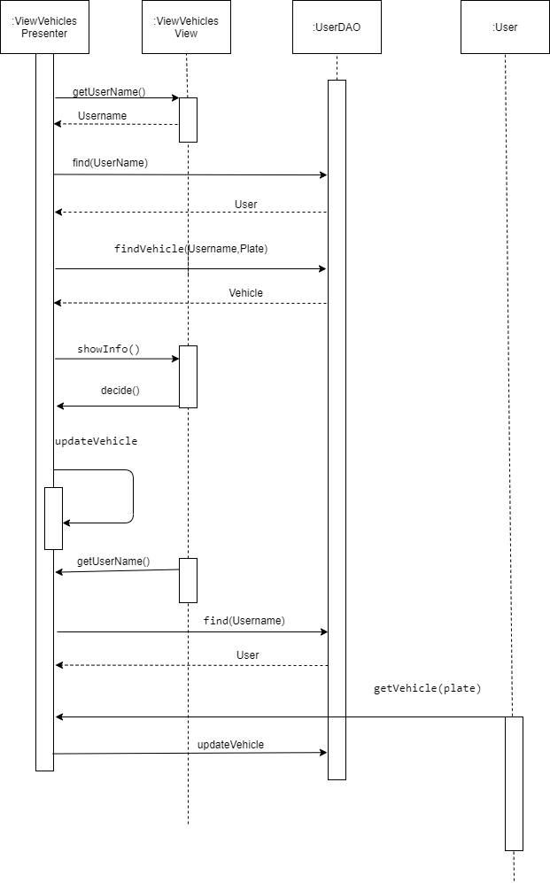

# Είσοδος Στο Σύστημα / Login

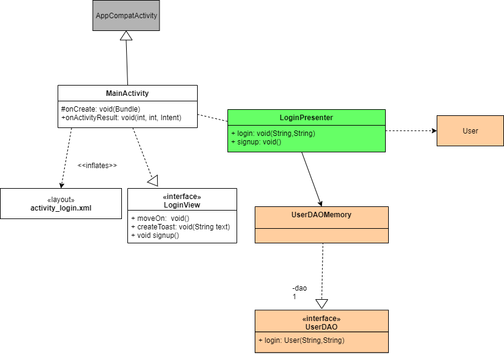   
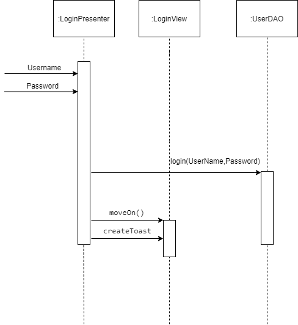

# Εγγραφη Στο Σύστημα / Sign Up add()

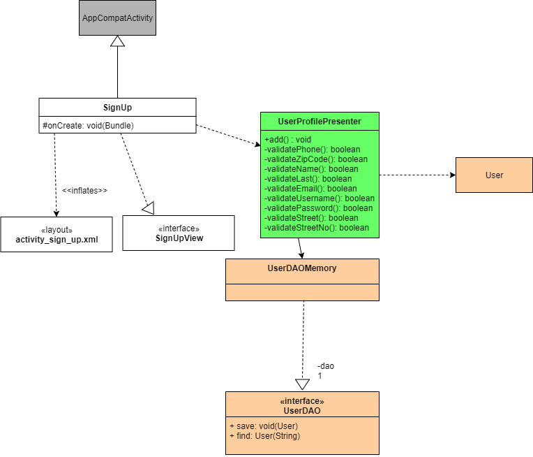   
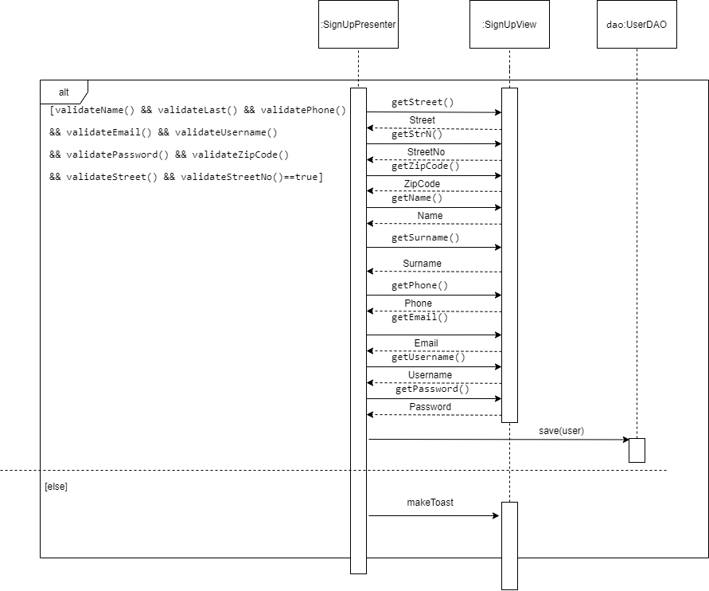

# Επαναφόρτιση Πιστωτικών Μονάδων / Add Credits

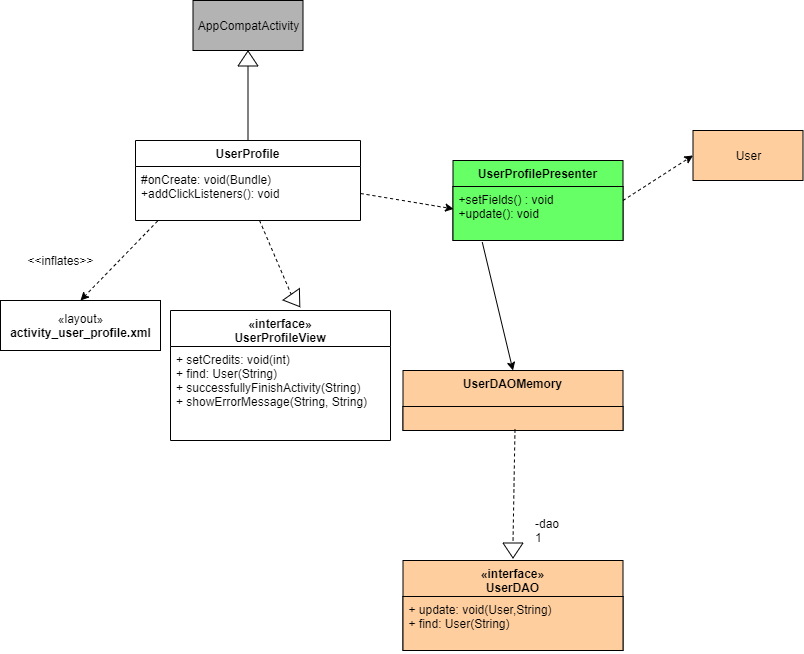   
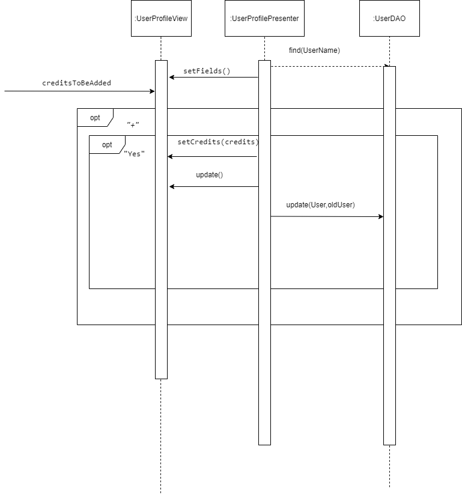

# Επιβεβαίωση διαθεσιμότητας θέσης / Parking Space on arrival Notification
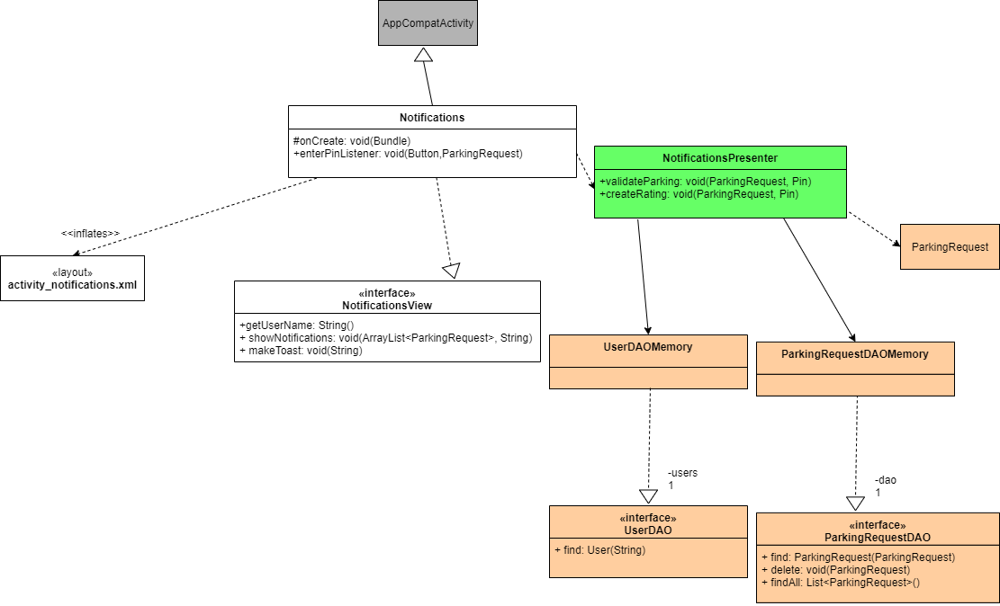   
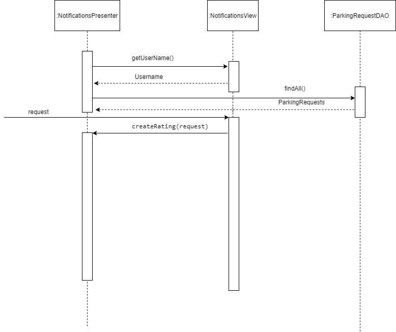

