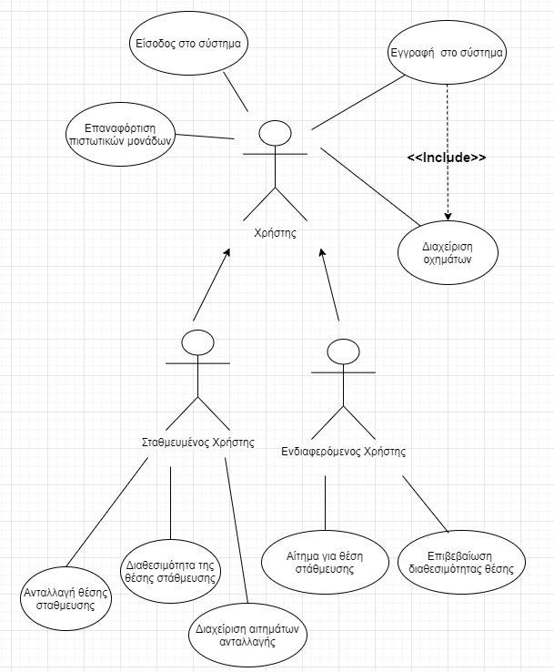

## Σύντομη περιγραφή περιπτώσεων χρήσης
  
* ###### Εγγραφή στο σύστημα
    Ο χρήστης βάζει στο σύστημα τα προσωπικά στοιχεία του και τα στοιχεία του οχήματός του ώστε να ενεργοποιηθεί ο λογαριασμός. 
  
* ###### Είσοδος στο σύστημα
    Ο χρήστης κάνει log-in στο σύστημα με τα credentials του.

* ###### Διαχείριση οχημάτων
    Ο χρήστης μπορεί αν θέλει να προσθέσει παραπάνω οχήματα αφού εγγραφεί.

* ###### Διαθεσιμότητα της θέσης στάθμευσης
    Ο σταθμευμένος χρήστης γνωστοποιεί την διαθεσιμότητα της θέσης πάρκινγκ, παρέχοντας την διεύθυνση, την ώρα και τις πιστωτικές μονάδες

* ###### Αίτημα για θέση στάθμευσης
    Ο ενδιαφερόμενος χρήστης δηλώνει την περιοχή που τον ενδιαφέρει να βρει parking και και τον εκτιμώμενο χρόνο
    άφιξής τους. Έπειτα, του εμφανίζονται οι διαθέσιμες θέσεις parking επιλέγει την καλύτερη για αυτόν.

* ###### Διαχείριση αιτημάτων ανταλλαγής
    Ο σταθμευμένος χρήστης επεξεργάζεται το αίτημα (αποδοχή ή απόρριψη αιτήματος).

* ###### Επιβεβαίωση διαθεσιμότητας θέσης
    Ο ενδιαφερόμενος χρήστης επιβεβαιώνει τη διαθεσιμότητα της θέσης και βλέπει τον μοναδικό κωδικό προς κοινοποίηση στον Σταθμευμένο χρήστη. 
    Αν πραγματοποιηθεί η συναλλαγή, τότε μεταφέρονται από τον λογαριασμό του ενδιαφερόμενου πιστωτικές μονάδες, αλλά μπορεί να υπάρξει επιβάρυνση αν καθυστερήσει.

* ###### Ανταλλαγή θέσης στάθμευσης
    Ο σταθμευμένος χρήστης καταχωρεί τον κωδικό.

* ###### Επαναφόρτιση πιστωτικών μονάδων
    Οι χρήστες έχουν την δυνατότητα επαναφόρτισης πιστωτικών μονάδων.

    
